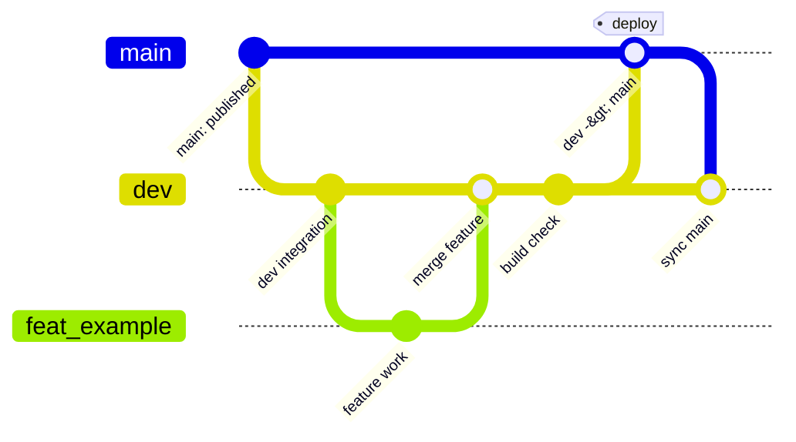

# 開発・貢献規約

この文書は、開発環境、branch、品質gate、release、生成物、資源責務、実装規約、文書同期をまとめる正本です。個別directoryのREADMEや `.codex/skills/` は固有の操作だけを補足し、共通規約はここを参照します。

## 開発環境と基本コマンド

GitHub Actionsと同じNode.js 24系を使います。依存関係は `package-lock.json` を正として再現するため、通常の検証では `npm ci` を使います。依存を意図的に更新するときだけnpmでmanifestとlockfileを同時に更新します。

```sh
npm ci
npm run dev
npm test
npm run build
npm run preview
```

個別の静的gateは次のとおりです。

- `npm run test:docs`: Markdownのlocal link、文書化したnpm script、全lockfile dependency、利用中Web font/CDN package、bundled font/vendor、READMEのOpen Graph画像を検証する
- `npm run lint:workflows`: actionlintでGitHub Actionsの構文、式、権限、shellを検証する
- `npm test`: 上記文書・font検証を含むNode test suiteを実行する
- `npm run build`: ViteでGitHub Pages向けの `dist/` を生成する

`npm run lint:workflows` にはactionlint 1.7.12を使います。CIはversion固定の公式containerを使い、ローカルでは同versionのbinaryをPATHへ置きます。

## branchとrelease

リモート設定、既存workflow、履歴を照合した現在の責務は次のとおりです。

- `dev`: 通常変更を統合する開発branch
- `main`: GitHub Pages公開を所有するrelease branch兼remote default branch
- `feat/*` など: 必要な場合だけ使う短期branch。`dev` へfast-forward可能またはreview可能な形で統合する

通常は `dev` で検証済みcommitをpushし、公開時に `dev` の内容をreviewして `main` へ取り込みます。branch名や公開条件を変える場合は、remote設定、branch protection、workflow、READMEではなくこの文書を同じchangeで更新します。

手動workflow実行は安全側に倒し、分類結果にかかわらずtest、build、deployを要求します。自動deployは公開branchへのpushかつ公開artifact classの変更だけです。



## 変更分類と品質gate

分類の正本は `.github/change-policy.json`、判定実装は `scripts/change-classification.mjs` です。複数classが混ざる場合は、`artifact`、`validation`、`documentation`、`metadata` の順に強いgateを使います。未知のfileは安全側で `artifact` に分類します。

| Class | 代表例 | ローカル / CI gate | Build / deploy |
| --- | --- | --- | --- |
| `documentation` | root README、`docs/`、Agent向けMarkdown | `npm run test:docs` | しない |
| `validation` | `test/`、`scripts/`、workflow、validation script | `npm ci`、`npm test`、`npm run lint:workflows` | しない |
| `metadata` | `package.json` のdescription等だけ、dependency graph不変のlockfile root metadata | change classificationのみ | しない |
| `artifact` | `src/`実装、SCAD、`index.html`、Vite/build設定、`public/`配信物、dependency graph | `npm ci`、`npm test`、`npm run lint:workflows`、`npm run build` | release branchだけdeploy |

`package.json` はfield差分を、`package-lock.json` はroot metadataを除いたdependency graphを比較します。build script、runtime/build dependency、lockfile package entryが変われば `artifact` です。test/lint scriptだけの変更は `validation` です。専用workflowが所有する資源は `.github/change-policy.json` の `dedicatedWorkflowOwnership` へ登録し、通常workflowとの重複実行を避けます。現在、その対象はありません。

build jobは必須test jobの成功後だけ実行し、deploy jobはbuild成功後だけ実行します。job-level permissionsを使い、Pages writeとOIDC権限はdeploy jobだけに付与します。

## 手動・環境固有の確認

自動gate後、変更した責務に限って [manual-verification.md](docs/guide/manual-verification.md) を使います。

- app-visible UI、preview、runtime asset loadingを変えた: 対応するブラウザ項目
- SCAD geometry、preview mesh、exportを変えた: representative sampleと該当export
- 3MF part構造を変えた: Bambu Studio等の実slicer
- macOS、codec、GPU、real-time frameに依存する処理を変えた: 対応する実環境

root overviewや `docs/` だけの変更では静的な文書gateだけを実行し、本番build、目視、実ブラウザ、Simulator確認は行いません。testやworkflowだけの変更ではCI相当のtest/lintまでに留めます。`public/` のnoticeやREADMEはPages artifactへコピーされるためbuildまでは通しますが、app-visibleな挙動が変わらないためブラウザ確認は不要です。

## directoryと資源の責務

- `src/`: Web app、状態、i18n、preview、export、SCAD bridge
- `scad/base/`: whole-key orchestrationとexport target
- `scad/modules/`: 再利用geometry
- `scad/presets/`: SCAD固有のnominal constant
- `scad/samples/`: geometry regression用の明示的fixture
- `public/`: Viteが加工せず公開物へコピーするruntime、font、image、license/provenance
- `test/`: Nodeで再現できるbehavior、geometry、文書、分類の自動test
- `docs/architecture/`: 現行の構造とcontract
- `docs/guide/`: 手動確認と個別の運用ガイド
- `docs/decisions/`: 歴史的な判断記録。現行仕様と衝突する場合はarchitecture/guideを優先する
- `docs/backlog/`: 未採用または未完了の将来案
- `docs/design/`: 過去のPencil sourceとrender。現在の実装仕様の正本ではない
- `.codex/skills/`: repository固有作業を補助するAgent手順。共通規約を複製しない

`dist/` と `.tmp/` は無視対象の生成物・調査用一時成果物です。継続保守の必須入力、出典の唯一の証拠、release commit対象にしません。再現に必要なfixture、official asset、license/provenanceは責務に合う追跡directoryへ置きます。

## 実装上の共通規約

- previewとexportの責務、body/top-hat/rim/homing/legendの体積責務を保つ
- shape初期値と表示groupは `src/data/keycap-shapes/*.json`、SCAD parameter mappingは `src/lib/keycap-scad-bundle.js` を正とする
- font/icon attributionはdata定義から実文を表示し、抽象的な警告文を別実装しない
- user inputの長文全般へ一律の改行規則を課さない。現在の折返し契約は、`.font-attribution-card__body` の改行保持とURL折返し、`.import-binding-notice__name` / `__value` の長いJSON path/value、`.preview-color-option__label` の選択肢labelに限定する。export dialog titleのようにellipsisを契約とする箇所は変更しない
- 新しい外部資源は、公式source、version、license本文、必要なnotice、利用箇所を確認してから追加する

## 文書・実装・test・workflowの同期

- 構造またはcontractを変える: `docs/architecture/` と対応testを更新する
- operator手順または品質gateを変える: `CONTRIBUTING.md`、`docs/guide/`、npm script、workflow、分類testを更新する
- 採用済みの長期判断を変える: `docs/decisions/decision-log.md` に追記し、現行仕様はarchitecture/guideへ反映する
- 未採用案を実装した: backlogを現行仕様へ統合し、backlog側へ採用済み状態と参照先を残すか削除する
- dependency、font、icon、vendored code、外部assetを変える: [第三者コンポーネントとライセンス](docs/third-party-licenses.md)、同梱notice/provenance、静的validatorを同期する
- metadataまたはOpen Graph画像を変える: `index.html` とroot overviewの画像参照を同期する
- 追跡fileを検証後に変えた: 変更classを再判定し、必要なgateを再実行する

## commit、push、Actions確認

1. `git fetch --prune` 後、作業branchと対応remote、release branchのahead/behindを確認する。
2. tracked/untrackedを含む全差分をreviewし、無関係なユーザー変更を含めない。
3. 変更classに必要なgateとactionlintを成功させる。
4. projectのbranch運用に従い、fast-forward可能なcommitを対応remoteへpushする。
5. Actionsでclassificationと必要jobの成功、不要jobのskip、warning/annotation不在を確認する。
6. failureやdeprecated Action/runtime warningがあれば、公式stable版と実装を確認して修正し、gateとActions確認をやり直す。
