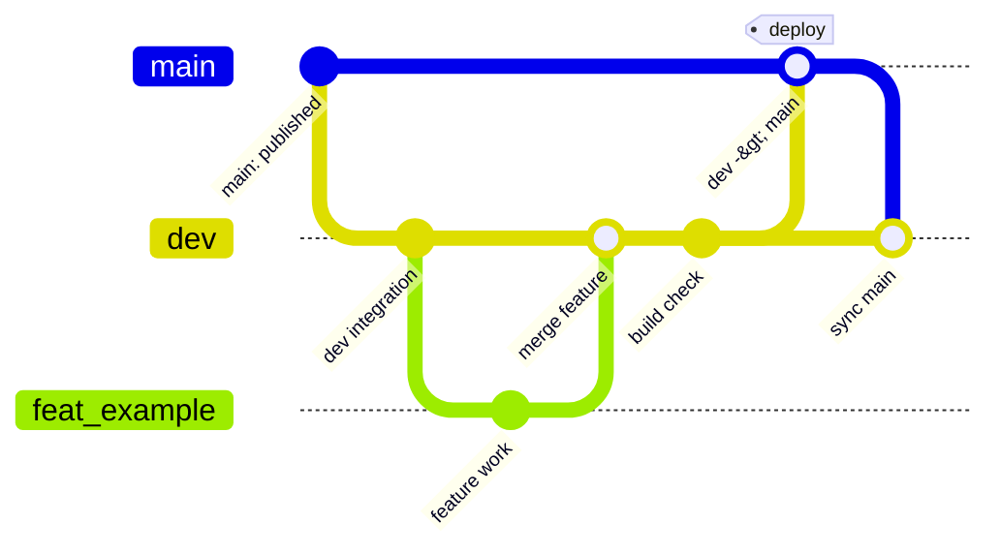

# KeycapMaker

GitHub Pages で配信する、キーキャップ編集 Web アプリのためのリポジトリです。

現在の目的は、既存実装を継続して保守・拡張できる状態を維持することです。アプリ本体、SCAD 資産、実運用向けのドキュメントをこのリポジトリ内で完結させます。

## 最初に読む資料

- 文書案内: [docs/README.md](docs/README.md)
- アプリ全体像: [docs/architecture/overview.md](docs/architecture/overview.md)
- SCAD / export 契約: [docs/architecture/scad-and-export.md](docs/architecture/scad-and-export.md)
- 開発運用: [docs/guide/development.md](docs/guide/development.md)

## 補助資料

- デザイン正本: [docs/design/README.md](docs/design/README.md)
- 手動確認手順: [docs/guide/manual-verification.md](docs/guide/manual-verification.md)
- 判断記録: [docs/decisions/decision-log.md](docs/decisions/decision-log.md)
- 用語集: [docs/reference/glossary.md](docs/reference/glossary.md)
- 印字拡張 TODO: [docs/backlog/legend-extensibility-todo.md](docs/backlog/legend-extensibility-todo.md)

## リポジトリの前提

- 配信先は GitHub Pages であり、サーバーサイド前提では進めない
- 動的処理はクライアントサイドで実行する
- ブラウザ内で OpenSCAD WASM ランタイムを実行する
- プレビュー経路と export 経路は責務分離する
- キーキャップ本体と印字は別体積で扱える構成を維持する
- 現在のユーザー向け書き出しは `3MF`、単色形状用の `STL`、編集再開用の `JSON` である
- 色情報は補助的に扱い、製造上の意味づけは separate volume を優先する

## ディレクトリ概要

- `src/`: Web アプリ本体の実装
- `public/`: GitHub Pages でそのまま配信する静的アセット
- `scad/`: キーキャップ形状の SCAD 資産
- `docs/`: 実装手順、調査資料、仕様メモ
- `.github/workflows/`: GitHub Actions と GitHub Pages デプロイ設定の置き場

## 開発

- 依存関係の導入: `npm install`
- 開発サーバー: `npm run dev`
- 本番ビルド確認: `npm run build`
- ビルド成果物の確認: `npm run preview`

## ブランチ運用

- `main`: GitHub Pages へ公開される安定ブランチ。削除しない
- `dev`: 通常開発の統合ブランチ。削除しない
- `feat/*`: 個別作業用の短期ブランチ。必要に応じて `dev` へ取り込む
- `dev` の内容を `main` へ push / merge したタイミングで、デプロイ対象パスに変更がある場合だけ GitHub Pages デプロイを実行する
- `dev` や `feat/*` への push、または `docs/` など Web 配信資源に関係しない変更だけの push ではデプロイしない

## デプロイ

- GitHub Pages 用ワークフロー: [.github/workflows/deploy-pages.yml](.github/workflows/deploy-pages.yml)
- 初回公開時は、GitHub 側で Pages の利用設定と公開 URL の確認が必要です
