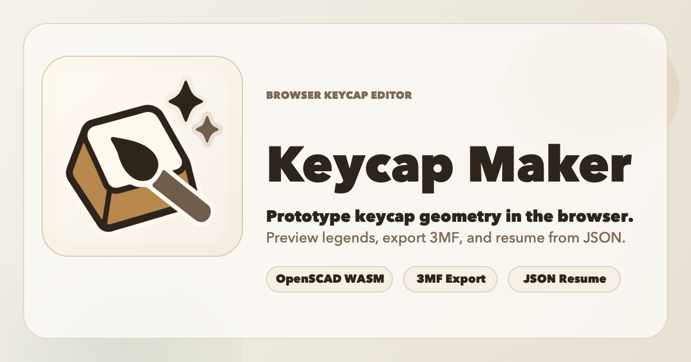

# KeycapMaker

KeycapMakerは、キーキャップの形状、印字、homing、stemをブラウザで調整し、製造・編集用データを書き出すクライアントサイドWebアプリです。

公開版は [GitHub Pages](https://masashi-desu.github.io/KeycapMaker/) から利用できます。サーバーへのインストールやアカウント登録は不要です。

## 公開物の構成

- ブラウザ内のOpenSCAD WebAssemblyでキーキャップ形状を生成する
- Three.js previewで形状と部品の配置を確認する
- body、top-hat、rim、homing、legendを用途に応じて別体積として扱う
- 印刷向け `3MF`、CAD交換向け `STEP`、単色形状向け `STL`、編集再開向け `JSON`、複数キーを束ねるproject ZIPを書き出す
- bundled font、icon provider、公式CAD由来の参照meshを静的資源として配信する

## 開発・保守

- [開発・貢献規約](CONTRIBUTING.md)
- [文書案内](docs/README.md)
- [アプリ全体像](docs/architecture/overview.md)
- [SCAD / export契約](docs/architecture/scad-and-export.md)
- [プロジェクトデータ仕様](docs/architecture/project-data.md)

## 第三者資源

利用中のruntime、npmの直接・間接依存、platform optional package、vendored code、Web font、icon、CAD資源とライセンス本文は、[第三者コンポーネントとライセンス](docs/third-party-licenses.md)に一覧化しています。
