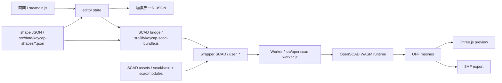

# アプリ全体像

## 現在のプロダクト範囲

Keycap Maker は、GitHub Pages で配信するクライアントサイド完結のキーキャップ編集アプリです。現在の主要機能は次のとおりです。

- キーキャップ形状の編集
- legend の文字列、書体、font 内 style、明示的な太さ補正、位置、高さ、埋め込み量の編集
- homing bar と stem 方式の切り替え
- typewriter shape 専用の key rim 追加
- Three.js によるプレビュー
- 3MF の書き出し
- 編集再開用 JSON の保存とドラッグ & ドロップ読み込み

## 実装上の固定前提

- 配信は GitHub Pages を使う
- サーバーサイド処理は前提にしない
- OpenSCAD 実行、プレビュー、export はブラウザ内で完結させる
- preview と export は責務を分ける
- body / legend は separate volume を維持する
- 色指定は補助情報であり、部位の意味づけは別体積構造を優先する

## コードの主な責務

### UI と状態管理

- `src/main.js`
  アプリ状態、フォーム、プレビュー更新、export、JSON 入出力の中心
- `src/lib/editor-data.js`
  編集データ JSON の canonical export と、欠損を defaults で補う互換入力 JSON の import を扱う
- `src/data/keycap-shape-registry.js`
  shape JSON の集約、selector、既定 shape の解決
- `src/data/keycap-shapes/*.json`
  shape ごとの初期値、geometry defaults、表示グループ定義
- `src/lib/keycap-fonts.js`
  legend font の選択肢と style 解決を UI / export / import で共有する

### OpenSCAD 実行

- `src/lib/openscad-client.js`
  Web Worker 起動の薄いクライアント
- `src/openscad-worker.js`
  bundled runtime を使って OpenSCAD ジョブを実行する worker
- `public/vendor/openscad/`
  同梱している OpenSCAD WASM ランタイム

### SCAD ブリッジ

- `src/lib/keycap-scad-bundle.js`
  SCAD ファイル群、フォント、wrapper SCAD を runtime へ渡す橋渡し
- `scad/base/keycap.scad`
  キーキャップ全体のエントリポイント
- `scad/modules/`
  shell、legend、stem、homing bar などの再利用形状
- `scad/presets/`
  SCAD 固有の nominal constant や sample 用 parameter set

### プレビューと export

- `src/lib/off-parser.js`
  OFF メッシュを JS で扱うためのパーサ
- `src/lib/preview-scene.js`
  Three.js による preview 表示
- `src/lib/export-3mf.js`
  OFF メッシュ群から 3MF パッケージを生成

## データの流れ

1. `src/main.js` で UI 入力を state に保持する
2. `src/lib/keycap-scad-bundle.js` が `user_*` 定義を含む wrapper SCAD を生成する
3. worker が bundled OpenSCAD runtime で SCAD を実行する
4. preview では OFF を解析して Three.js 表示に渡す
5. export では OFF を part ごとに集め、3MF または編集データ JSON を生成する
6. import では保存済みの編集データ JSON または sparse な互換入力 JSON を defaults とマージして state を復元する

### Mermaid で見る全体フロー

## 現在のユーザー向け出力

- `3MF`
  body / rim / homing / legend の各メッシュを part としてまとめる
- `編集データ JSON`
  UI 状態を保存し、あとで再読み込みするためのフォーマット

現在の UI に STL 書き出しはなく、STL は lower-level runtime capability としてのみ存在する。

## 現時点の実装制約

- legend は単一項目モデルで、複数 legend や side legend は未対応
- legend の露出面は top dish 前提
- variable font の native style は使えるが、italic / slanted は font 側に実データがない限り出せない
- 3MF の色情報は付与しているが、スライサー互換性は別途手動確認が必要
- OpenSCAD runtime とフォント同梱のライセンス確認は人間の最終確認が必要

## 関連資料

- [scad-and-export.md](scad-and-export.md)
- [../guide/development.md](../guide/development.md)
- [../guide/manual-verification.md](../guide/manual-verification.md)
- [../backlog/legend-extensibility-todo.md](../backlog/legend-extensibility-todo.md)
