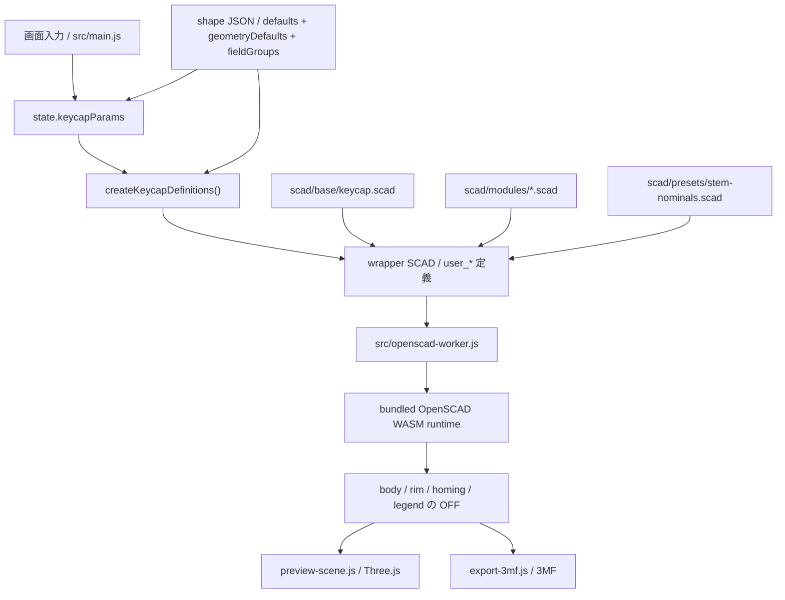

# SCAD / Export 契約

## SCAD ディレクトリの責務

- `scad/base/`
  whole-key のエントリポイントと export 切り替え
- `scad/modules/`
  shell、legend、stem、homing bar などの再利用部品
- `scad/presets/`
  SCAD 固有の nominal constant や sample 用 parameter set
- `scad/samples/`
  形状回帰確認に使うサンプル

## 現在のキーキャップエントリ

`scad/base/keycap.scad` が現在の基準エントリです。`export_target` で次を切り替えます。

- `preview`
- `body`
- `body_core`
- `rim`
- `homing`
- `legend`

この構成により、preview 用表示と part 単位 export を同じ基礎形状から扱います。

## separate volume の扱い

- body / rim / legend は別体積を維持する
- homing bar は body 側の触覚マーカーとして扱い、legend と混ぜない
- body / rim / legend / homing の相対位置は共有原点で揃える
- 色だけに依存せず、mesh 自体を part として分ける

## preview と export の責務分離

- preview:
  反応速度と見た目確認を優先する
- export:
  part 分離と形状の意味づけを優先する

現在の preview は OFF メッシュを body / rim / homing / legend ごとに生成して Three.js へ渡します。現在の export は同じ part 群から 3MF を組み立てます。

legend の `text()` は bundled OpenSCAD runtime 上で preview / export の `quality` に応じて曲線分割数を上げ、内部では拡大してから縮小する。これにより、小さい文字サイズでも丸みのある書体の輪郭が過度に角張るのを抑える。font の native style は JS 側で `font` query を組み立てて指定し、ユーザー操作なしの擬似 bold / italic / slanted は行わない。下線は font file の `post` / `head` / `hhea` から `UnderlinePosition` / `UnderlineThickness` / line box 中心を読み、`valign="center"` な text 座標へ変換したうえで実測文字幅と組み合わせる。font metadata を取れない場合の任意フォールバックは行わない。輪郭補正は `legendOutlineDelta` を通した明示入力時だけ `offset()` を使う。
legend の文字サイズは UI の `legendSize` をそのまま基準にし、文字数に応じた自動縮小や単一文字だけの自動拡大は行わない。

## UI から SCAD への橋渡し

OpenSCAD browser runtime では `-D` 上書きが安定しなかったため、実行ごとに wrapper SCAD を生成して `user_*` 定義を注入します。

主な橋渡しファイル:

- `src/lib/keycap-scad-bundle.js`
- `src/data/keycap-shape-registry.js`
- `src/data/keycap-shapes/*.json`
- `scad/presets/stem-nominals.scad`

現在のキートップ姿勢パラメータは `topCenterHeight` を基準にし、前後は `topPitchDeg`、左右は `topRollDeg` へ正規化する。UI では端高さ入力も使えるが、保存と SCAD bridge はこの正規化表現を使う。
shell shape の `topScale` は UI パラメータとして保持しつつ、JS bridge で shape JSON の geometry defaults から最終的な前後左右角度へ解決してから SCAD へ渡す。
shape ごとの初期値、geometry defaults、表示グループ構成は `src/data/keycap-shapes/*.json` に置き、SCAD 側は top-level user parameter に対してフェイルセーフ default を持たない。JS bridge が shape JSON から必要値をすべて解決して `user_*` として注入する。

stem は希望高さの nominal 形状を先に作り、最後に keycap 内部クリアランス volume と `intersection()` して止める。これにより、強い `pitch / roll` があっても stem はキートップ裏面に当たった位置で自動的に止まり、単純な高さ抑制より自然に追従する。

### Mermaid で見る画面 JSON SCAD WASM の流れ

ルール:

- UI の追加パラメータは `src/main.js` と `src/lib/keycap-scad-bundle.js` を同時に更新する
- geometry contract が変わる場合は `scad/base/` または `scad/modules/` を更新する
- shape ごとの初期値と表示グループは shape JSON に集約し、SCAD は explicit parameter のみ受ける

## サンプルの位置づけ

- `scad/samples/keycap-1u.scad`
  現行キーキャップ構成の回帰確認用
- `scad/samples/keycap-typewriter-rim.scad`
  typewriter shape の key rim 分離確認用
- `scad/samples/keycap-legend-seat.scad`
  flush legend の座面切り抜き確認用
- `scad/samples/keycap-multi-character-legend.scad`
  複数文字でも自動縮小せず、明示サイズを保つか確認する回帰用
- `scad/samples/keycap-rounded-legend.scad`
  丸みのある書体で legend 輪郭の品質を確認する回帰用
- `scad/samples/keycap-homing-bar.scad`
  homing bar の単体確認用
- `scad/samples/keycap-stem-clip.scad`
  強い左右傾斜で stem の上端が内部天井に沿って止まるか確認する回帰用
- `scad/samples/keycap-top-orientation.scad`
  上面中央高さ固定 + pitch / roll の回帰確認用
- `scad/samples/stem-mounts.scad`
  stem mount 差分の確認用

サンプルは現在、geometry regression のために使う。

## 現在の export 契約

### 3MF

- 出力元は OFF メッシュ
- 3MF 内では part ごとに object を分ける
- 現在の part 候補は `body`、`rim`、`homing`、`legend`
- legend が無効なら legend object は含まれない
- typewriter key rim が無効なら rim object は含まれない
- homing bar が無効なら homing object は含まれない

### 編集データ JSON

- UI state の保存と再読み込み用
- `schemaVersion` を持つ
- `params.name` に保存名を含める
- geometry export ではなく、作業再開用フォーマットとして扱う
- JSON / 3MF のダウンロードファイル名は `params.name` を基準にする

## 現在の既知制約

- legend は単一モデル
- legend の露出面は top dish 前提
- side legend は未対応
- font asset は variable / static の混在を許容するが、native style の有無は font ごとに異なる

これらの拡張 TODO は [../backlog/legend-extensibility-todo.md](../backlog/legend-extensibility-todo.md) にまとめる。

## 更新ルール

- SCAD の責務境界が変わったらこの文書を更新する
- export の part 契約が変わったらこの文書と手動確認手順を更新する
- 採用判断は [../decisions/decision-log.md](../decisions/decision-log.md) に残す
