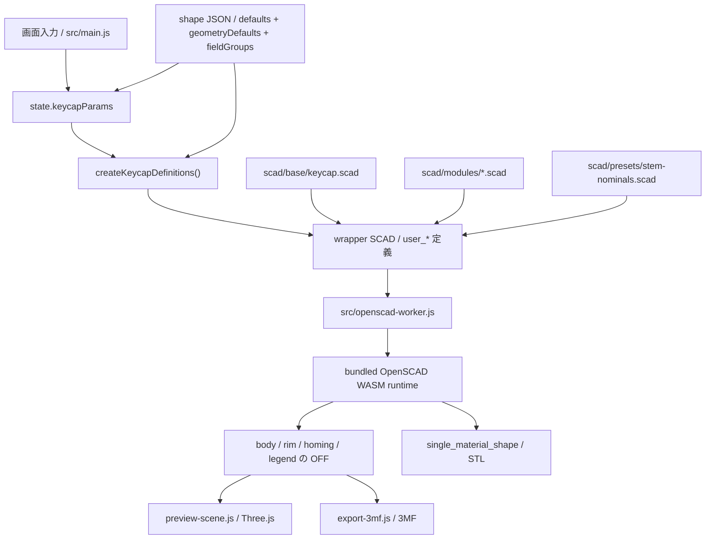

# SCAD / Export 契約

## SCAD ディレクトリの責務

- `scad/base/`
  whole-key のエントリポイントと export 切り替え
- `scad/modules/`
  shell、legend、stem、homing bar などの再利用部品
- `scad/presets/`
  SCAD 固有の nominal constant や sample 用 parameter set
- `scad/samples/`
  形状回帰確認に使うサンプル

## 現在のキーキャップエントリ

`scad/base/keycap.scad` が現在の基準エントリです。`export_target` で次を切り替えます。

- `preview`
- `body`
- `body_core`
- `rim`
- `homing`
- `legend`
- `single_material_shape`

この構成により、preview 用表示と part 単位 export を同じ基礎形状から扱います。

## separate volume の扱い

- body / rim / legend は別体積を維持する
- homing bar は body 側の触覚マーカーとして扱い、legend と混ぜない
- body / rim / legend / homing の相対位置は共有原点で揃える
- 色だけに依存せず、mesh 自体を part として分ける

## preview と export の責務分離

- preview:
  反応速度と見た目確認を優先する
- export:
  part 分離と形状の意味づけを優先する

現在の preview は OFF メッシュを body / rim / homing / legend ごとに生成して Three.js へ渡します。Three.js 側では shared vertex を保った indexed geometry を基準に creased normals を作り、曲面は滑らかに、急角は残す。SCAD 側の円弧分割は feature の半径と `quality` に応じて上限付きで増やす。現在の 3MF export は同じ part 群から 3MF を組み立てます。STL export は `single_material_shape` target から OpenSCAD runtime の STL 出力を直接使い、色と legend を含まない単一メッシュとして扱います。

legend の `text()` は bundled OpenSCAD runtime 上で preview / export の `quality` に応じて曲線分割数を上げ、内部では拡大してから縮小する。これにより、小さい文字サイズでも丸みのある書体の輪郭が過度に角張るのを抑える。font の native style は JS 側で `font` query を組み立てて指定し、ユーザー操作なしの擬似 bold / italic / slanted は行わない。下線は font file の `post` / `head` / `hhea` から `UnderlinePosition` / `UnderlineThickness` / line box 中心を読み、`valign="center"` な text 座標へ変換したうえで実測文字幅と組み合わせる。font metadata を取れない場合の任意フォールバックは行わない。輪郭補正は `legendOutlineDelta` を通した明示入力時だけ `offset()` を使う。
legend の文字サイズは UI の `legendSize` をそのまま基準にし、文字数に応じた自動縮小や単一文字だけの自動拡大は行わない。
legend の作業領域はキーキャップ上面の footprint を上限にしない。文字が大きすぎる場合も自動縮小せず、SCAD 側の surface fitting 用領域を十分広く取って、legend part がキー上面からはみ出すことを許可する。

## UI から SCAD への橋渡し

OpenSCAD browser runtime では `-D` 上書きが安定しなかったため、実行ごとに wrapper SCAD を生成して `user_*` 定義を注入します。

主な橋渡しファイル:

- `src/lib/keycap-scad-bundle.js`
- `src/data/keycap-shape-registry.js`
- `src/data/keycap-shapes/*.json`
- `scad/presets/stem-nominals.scad`

現在のキートップ姿勢パラメータは `topCenterHeight` を基準にし、前後は `topPitchDeg`、左右は `topRollDeg` へ正規化する。UI では端高さ入力も使えるが、保存と SCAD bridge はこの正規化表現を使う。
`topOffsetX` / `topOffsetY` は stem 原点を動かさず、キートップ上面側の中心を左右 / 前後にずらす。SCAD 側では body shell、rim、legend、homing bar と stem clip 用の内側 clearance へ同じ XY offset を渡し、stem 本体は原点に残す。
キートップ形状は `topSurfaceShape` で `flat` / `cylindrical` / `spherical` を切り替える。`dishDepth` はプラスで凹み、マイナスで盛り上がりを表す。
SCAD 側では dish も top plane と同じ座標変換へ載せるため、`topPitchDeg` / `topRollDeg` を変えても cylindrical / spherical の局所形状を保ったまま傾けられる。
shell shape の `topScale` は UI パラメータとして保持しつつ、JS bridge で現在の `keyWidth` / `keyDepth` / `topCenterHeight` から最終的な前後左右角度へ解決してから SCAD へ渡す。上面の footprint は `keyWidth * topScale` と `keyDepth * topScale` を目標にするため、正方形キーはすぼめても上面が正方形のまま縮む。初期値 `0.75` は 18mm の 1u キーで上面を約 13.5mm にする。
custom shell は `topHatEnabled` で上面にもう一つの小さいキートップを追加できる。top-hat は body 側の形状として扱い、`topHatTopWidth` / `topHatTopDepth` / `topHatTopRadius` / `topHatHeight` / `topHatShoulderAngle` / `topHatShoulderRadius` を `user_*` へ渡す。`topHatHeight` がマイナスの場合は同じ形状を上面から凹ませ、シェル天井を貫通しない深さに丸める。`topHatShoulderRadius` は 0 で角面、正値で shoulder の断面を丸め、負値で凹ませる。最大絶対値は実際の shoulder 高さと横幅の小さい方に丸めるため、45 度では横から見た断面が 1/4 円状になるところまで指定できる。JIS Enter や typewriter 系にはまだ表示しない。
JIS Enter shape は `jis_enter` geometry type として扱う。既定値は一般的な縦長 Enter footprint の 1.5u x 2u、左下欠き込み 0.25u x 1u で、`jisEnterNotchWidth` / `jisEnterNotchDepth` により欠き込み量を編集できる。JIS X 6002 は物理キートップ寸法を規定しないため、この shape は実用上よく使われる JIS / ISO 系 keycap footprint のプリセットとして扱う。typewriter style の JIS Enter は `typewriter_jis_enter` geometry type とし、同じ JIS footprint を使いながら typewriter の薄型 top、rim、逆向き stem mount を適用する。
shape ごとの初期値、geometry defaults、表示グループ構成は `src/data/keycap-shapes/*.json` に置き、SCAD 側は top-level user parameter に対してフェイルセーフ default を持たない。JS bridge が shape JSON から必要値をすべて解決して `user_*` として注入する。

UI の `1u` 換算基準は狭ピッチ確認用の表示・入力補助として扱う。基準値を変えても `keyWidth` / `keyDepth` などのモデル寸法は変更せず、SCAD bridge や編集データ JSON にも渡さない。`u` 側の入力を編集したときだけ、現在の換算基準で mm 寸法へ変換して既存のモデルパラメータに反映する。

typewriter shape の取り付け高さは `typewriterMountHeight` で保持し、キートップ本体の上面中央から stem 下端までの距離として扱う。SCAD 側では `user_typewriter_mount_height` と `topCenterHeight` から実際の `stem_height` へ変換するため、`topCenterHeight` はキートップ本体の厚み、`typewriterMountHeight` は装着時の高さとして独立して調整できる。

stem は希望高さの nominal 形状を先に作り、最後に keycap 内部クリアランス volume と `intersection()` して止める。これにより、強い `pitch / roll` があっても stem はキートップ裏面に当たった位置で自動的に止まり、単純な高さ抑制より自然に追従する。

### Mermaid で見る画面 JSON SCAD WASM の流れ



ルール:

- UI の追加パラメータは `src/main.js` と `src/lib/keycap-scad-bundle.js` を同時に更新する
- geometry contract が変わる場合は `scad/base/` または `scad/modules/` を更新する
- shape ごとの初期値と表示グループは shape JSON に集約し、SCAD は explicit parameter のみ受ける

## サンプルの位置づけ

- `scad/samples/keycap-1u.scad`
  現行キーキャップ構成の回帰確認用
- `scad/samples/keycap-jis-enter.scad`
  JIS / ISO 系の縦長 Enter footprint とカスタムシェル相当の top surface 自由度を確認する回帰用
- `scad/samples/keycap-typewriter-jis-enter.scad`
  typewriter style の JIS Enter footprint、rim、mount 位置を確認する回帰用
- `scad/samples/keycap-typewriter-rim.scad`
  typewriter shape の key rim 分離確認用
- `scad/samples/keycap-typewriter-rim-tilted.scad`
  pitch / roll 付き typewriter key rim の接合確認用
- `scad/samples/keycap-typewriter-mount-height.scad`
  typewriter shape の上面基準取り付け高さ確認用
- `scad/samples/keycap-typewriter-spherical-top.scad`
  typewriter shape で spherical top が破綻しないか確認する回帰用
- `scad/samples/keycap-legend-seat.scad`
  flush legend の座面切り抜き確認用
- `scad/samples/keycap-curved-legend-seat.scad`
  spherical top でも legend 表面へ body が被らないか確認する回帰用
- `scad/samples/keycap-multi-character-legend.scad`
  複数文字でも自動縮小せず、明示サイズを保つか確認する回帰用
- `scad/samples/keycap-rounded-legend.scad`
  丸みのある書体で legend 輪郭の品質を確認する回帰用
- `scad/samples/keycap-sidewall-legend.scad`
  front / back / left / right の sidewall legend 配置確認用
- `scad/samples/keycap-homing-bar.scad`
  homing bar の単体確認用
- `scad/samples/keycap-stem-clip.scad`
  強い左右傾斜で stem の上端が内部天井に沿って止まるか確認する回帰用
- `scad/samples/keycap-surface-quality.scad`
  角丸外形、dish、stem 外周の曲面品質をまとめて確認する回帰用
- `scad/samples/keycap-top-orientation.scad`
  上面中央高さ固定 + pitch / roll の回帰確認用
- `scad/samples/keycap-top-offset.scad`
  stem 原点を固定したキートップ中心の XY offset 確認用
- `scad/samples/keycap-top-hat.scad`
  custom shell の top-hat キートップ確認用
- `scad/samples/keycap-top-hat-recess.scad`
  custom shell のマイナス高さ top-hat 凹み確認用
- `scad/samples/stem-mounts.scad`
  stem mount 差分の確認用

サンプルは現在、geometry regression のために使う。

## 現在の export 契約

### 3MF

- 出力元は OFF メッシュ
- 3MF 内では part ごとに object resource を分ける
- `build` には part 直列ではなく、body / rim / homing / legend 系 part を `components` として束ねた親 object を 1 件だけ置く
- 親 object の `name` には UI の `名称` を使う
- 現在の part 候補は `body`、`rim`、`homing`、`legend`、`legend-front`、`legend-back`、`legend-left`、`legend-right`
- キートップ legend が無効なら `legend` object は含まれない
- sidewall legend が無効なら対応する `legend-*` object は含まれない
- typewriter key rim が無効なら rim object は含まれない
- homing bar が無効なら homing object は含まれない
- 親 object には material / color を付けず、子 part object の material / color を維持する
- Bambu Studio / OrcaSlicer 向けに `Metadata/model_settings.config`、PrusaSlicer / Slic3r PE 向けに `Metadata/Slic3r_PE_model.config` を追加し、part 表示名を `body` / `rim` / `homing` / `legend` / `legend-*` として保持する
- Cura など標準3MF中心の importer 向けには、子 object の `name` と `partnumber` を保持する

### STL

- 出力元は `single_material_shape` target
- OpenSCAD runtime から binary STL として直接出力する
- body shell、stem、homing bar、typewriter rim を単一メッシュとして union する
- legend は出力に含めない
- 色、material、part 名、separate volume 情報は含めない
- 色分けや legend が必要な場合は 3MF を使う
- JSON / 3MF と同じく、ダウンロードファイル名は `params.name` を基準にする

### 編集データ JSON

- UI state の保存と再読み込み用
- 保存用の canonical JSON は `schemaVersion` を持つ
- `params.name` に保存名を含める
- geometry export ではなく、作業再開用フォーマットとして扱う
- JSON / 3MF / STL のダウンロードファイル名は `params.name` を基準にする
- 保存時は shape defaults を解決したフル設定を保持し、非活性 UI の値も落とさない
- 読み込み時は canonical JSON に加えて sparse な互換入力 JSON も受ける
- 互換入力 JSON は `params` 配下または top-level に既知パラメータを書ける。欠損したキーは shape defaults を使う
- `shapeProfile` が明示されていればその defaults を基準に bind し、未指定なら既定 profile を使う
- 未知のキーは無視し、既知キーだけを sanitize して state へ反映する

互換入力 JSON の最小例:

```json
{
  "shapeProfile": "typewriter",
  "legendText": "ESC",
  "rimEnabled": false
}
```

上の例では `rimWidth` や `legendColor` など未指定の値を typewriter の shape JSON defaults で補完したうえで、最終的な editor state を復元する。

## 現在の既知制約

- legend はキートップ 1 件と sidewall front / back / left / right の固定 4 面モデル
- キートップ legend の露出面は top dish 前提
- sidewall legend は各側面の中央基準面の傾きに合わせて配置し、壁の内側面まで自動で埋め込む。角丸や JIS Enter の欠き込み面へは自動追従しない
- font asset は variable / static の混在を許容するが、native style の有無は font ごとに異なる
- `high_preview` のような追加品質段階は未採用。必要になったら [../backlog/high-preview-quality-mode.md](../backlog/high-preview-quality-mode.md) を起点に再検討する

これらの拡張 TODO は [../backlog/legend-extensibility-todo.md](../backlog/legend-extensibility-todo.md) にまとめる。

## 更新ルール

- SCAD の責務境界が変わったらこの文書を更新する
- export の part 契約が変わったらこの文書と手動確認手順を更新する
- 採用判断は [../decisions/decision-log.md](../decisions/decision-log.md) に残す
